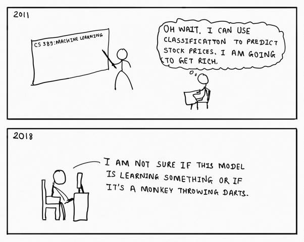

 
# MTI830 - ÉTSMINE 2018
## Prédictions des marchés de capitaux avec l'analyse de sentiments
par Michael Faille et Benoit Paquet

# Préambule
## Déroulement de la présentation
* Introduction
* Présentation de nos experts
* Premières expériences
* Méthodes
* Résultats
* Conclusion

## Introduction

## Objectif
#### Faire la prédiction de la valeur d'une action dans le futur avec: 
* Le deep learning
* Le cours de la bourse
* L'analyse de sentiments
* Les informations financières des compagnies

# Présentation de nos experts
## Présentation de Francis
* Partenaire d'affaire de Michael
* Ancien étudiant du MILA et diplômé en maîtrise à la Polytechnique
* Expert en Machine Learning et en investissement à la bourse
* a proposé l'hypothèse suivante:
  * Stock price * Sentiments = Discounted Cash Flow

## Présentation de Carl 
* Détient un MBA du HEC
* Fondateur de la startup Evovest
* Expert en finance et en machine learning

# Premières expériences
## Expérimentation avec sentiment140
#### Sentiment140 c'est:
* 1.6 millions de tweets disponible publiquement sur internet
* Publié par des étudiants en science informatique de l'université de Stanford
* Notre premier contact avec le deep learning
* Être capable d'attribuer un sentiment à une phrase grâce à un modèle

## Expérimentation avec sentiment140
#### Nos résultats nous ont démontrés qu'il:
* est difficile de corréler le sentiment avec la bourse
* nécessite beaucoup plus de travail pour valider le modèle
* nécessite encore plus de travail pour mettre la main sur un autre dataset de Twitter

# Recommendations de nos experts
## Dataset: FinSents 
#### Caractéristiques:
* Génère une valeur de sentiment par jour par compagnie
* La valeur provient de différentes sources:
  * Les journaux
  * Différents réseaux sociaux (comme Twitter)
  * Les blogues
* Dizaine de milliers de compagnies
* Offre d'autres colonnes tels le News Buzz et le News Volume

## Dataset: FinSents
#### Couvre les sentiments de compagnies à travers le monde:
  * 15 000 nord-américaines
  * 8 000 européennes
  * 4 000 japonaises
  * 14 000 asiatiques à l'exclusion du Japon
  * 3 000 Australie / Nouvelle-Zélande
  * 1 000 sud-américaines

## Dataset: Sharadar
#### Source d'information financière: 
* Sur plus de 12 000 compagnies américaines
* Représente plus d'une centaine d'attributs par compagnie
* Contient jusqu'à 20 ans d'historique

## Datasets
#### Possibilités de FinSents et Sharadar:
* Combinaison possible des datasets avec la date et le ticker
* disponibles sur Quandl
* Possibilité d'utiliser l'API de Quandl
* Possibilité de télécharger les datasets complets au format CSV
* Datasets payants au coût de 50$ par mois

#  Méthodes - Préparation des données
## Datasets

## Fusion des données 

## Entrainement d'un modèle avec LSTM 

## Présentation du LSTM 
* 
* 
* 

# Résultats

# Conclusion
##

## Travaux futurs
* Évaluer la pertinence des autres attributs du dataset
* Tester avec plus de tickers
* Utiliser plusieurs tickers pour entrainer un même modèle
* Modifier les paramètres d'entrainement du modèle
* Entrainer d'autres types de modèles et comparer les résultats

## Remerciements
#### Merci à:
* Sylvie Ratté pour son suivi sur le projet
* Francis Piéraut pour nous avoir introduit ce projet
* Michael Faille pour avoir sollicité Francis Piéraut dans la définition du projet.
* Carl Dussault pour ses conseils sur la finance

## Questions?
Merci pour votre attention!

code source disponible à  
https://github.com/MTI830PyTraders/TradingPlayground
